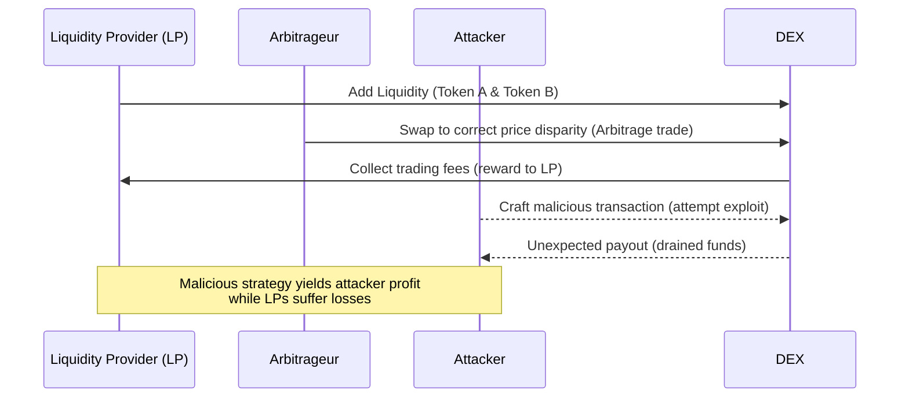

+++
title = "Game-Theoretical Assessment in DEX Protocols"
date = 2025-05-23T13:53:12+09:00
draft = false
math = "katex"
summary = "Exploring how game-theoretical modeling can be applied to decentralized exchange (DEX) protocols to identify design weaknesses and strategic attack vectors. We discuss the incentives and strategies of participants in Uniswap, SushiSwap, Cetus, and KyberSwap, illustrating how game theory can reveal exploits and inform more secure DEX design."
tags = ["DeFi", "DEX", "Game Theory", "Security", "Smart Contracts"]
aliases = ["/game-theoretical-assessment-dex-protocols"]
+++

**Table of Contents**
- [Introduction](#introduction)
- [What is Game-Theoretical Assessment?](#what-is-game-theoretical-assessment)
- [Game Theory in DEX Design and Incentives](#game-theory-in-dex-design-and-incentives)
  - [Players, Strategies, and Payoffs in DEXes](#players-strategies-and-payoffs-in-dexes)
- [Incentive Structures in Uniswap and Beyond](#incentive-structures-in-uniswap-and-beyond)
- [Case Studies: DEX Exploits through a Game-Theoretic Lens](#case-studies-dex-exploits-through-a-game-theoretic-lens)
  - [SushiSwap’s RouteProcessor2 Exploit (2023)](#sushiswaps-routeprocessor2-exploit-2023)
  - [KyberSwap’s Precision Bug Exploit (2023)](#kyberswaps-precision-bug-exploit-2023)
  - [Cetus Liquidity Pool Exploit (2025)](#cetus-liquidity-pool-exploit-2025)
- [Strategy Interaction Diagram](#strategy-interaction-diagram)
- [Implications for DEX Developers and Security](#implications-for-dex-developers-and-security)
- [Conclusion](#conclusion)
- [References](#references)

## Introduction

Decentralized exchanges (DEXes) have transformed crypto trading by replacing traditional order books with automated market maker (AMM) smart contracts. In these protocols (e.g. Uniswap, SushiSwap, Cetus, KyberSwap), a set of rules and formulas govern how trades execute and how liquidity is provided. However, the success and security of a DEX depend on more than just code correctness – it hinges on the incentives and strategies of the participants. Game-theoretical assessment is an approach that models a protocol as a game between rational players (traders, liquidity providers, arbitrageurs, attackers, etc.) to analyze their strategic interactions. By examining DEX protocols through a game-theoretic lens, developers and researchers can uncover potential design weaknesses or attack vectors that might not be evident from a code audit alone. 

High-profile incidents in DeFi’s recent history highlight the need for this perspective. Exploits on SushiSwap, Cetus, and KyberSwap (among others) each involved an attacker discovering a “winning” strategy within the rules of the protocol – a strategy that yielded profit for the attacker at the expense of honest participants. In hindsight, many of these exploits can be framed as failures of game design: the protocol’s rules inadvertently allowed a malicious strategy with an outsize payoff. In this post, we introduce the concept of game-theoretical assessment and illustrate how it applies to DEX design and security. We will discuss how modeling players, strategies, and payoffs in AMM-based exchanges can help identify vulnerabilities, using real case studies from Uniswap’s ecosystem and recent exploits on SushiSwap, Cetus, and KyberSwap. We’ll also provide a strategy interaction diagram and technical insights for developers on leveraging game theory to build and secure DEX contracts.

## What is Game-Theoretical Assessment?

Game theory is the study of strategic interactions among decision-makers. A game-theoretical assessment in the context of blockchain means evaluating a protocol by identifying the key players, their possible strategies, and the payoffs (outcomes) of those strategies. The goal is to ensure the system’s rules create incentives for honest behavior and make dishonest or malicious behavior unrewarding. In blockchain design, game theory is used to align incentives of participants so that the equilibrium (rational outcome) is a secure and efficient network state[^1]. In other words, if everyone is acting in their self-interest according to the game’s rules, the result should still uphold the protocol’s integrity (an idea often captured by the concept of Nash equilibrium for honest behavior[^2]).

In a game-theoretical model of a smart contract, we define the following elements: **players**, **strategies**, and **payoffs**. Players are the participants or roles in the protocol (for a DEX, this might include liquidity providers, traders/arbitrageurs, and potential attackers)[^3]. Each player has a set of strategies, meaning the actions or decisions they can take in various situations (e.g. an LP can choose to add or withdraw liquidity; an arbitrageur can trade when there’s a price discrepancy; an attacker can attempt an exploit if one is available)[^3]. For each combination of strategies, players receive payoffs – rewards or penalties resulting from those choices (for instance, an LP’s payoff could be trading fees earned minus any impermanent loss; an attacker’s payoff might be the funds stolen versus the cost of executing the attack)[^4]. By systematically analyzing these components, we can spot scenarios where a player might have an incentive to deviate from the intended “honest” behavior in a way that harms the protocol.

Understanding game theory is **essential for creating robust blockchain protocols that can withstand adversarial behavior and ensure network integrity**[^5]. Traditional smart contract audits focus on finding bugs in code logic, but a game-theory audit (or economic audit) focuses on finding economic or strategic flaws – situations where the design lets a participant gain by misbehaving. This kind of analysis asks questions like: “If a rational attacker stands to profit by doing $X$, will the protocol allow $X$, and if so, what stops them?” Ideally, a secure design has no profitable malicious strategies, or it imposes costs that outweigh any gains for attackers. In the next sections, we’ll examine how these principles apply specifically to DEX protocols, where multiple agents interact in a financial setting.

## Game Theory in DEX Design and Incentives

Decentralized exchanges operate via smart contracts that algorithmically set prices and facilitate trades using pooled liquidity. Participants in this system each have different incentives and roles, which can be analyzed as a game. Let’s break down the key players and see how game-theoretical thinking sheds light on DEX behavior and design.

### Players, Strategies, and Payoffs in DEXes

In a typical AMM-based DEX, the main players include:
* Liquidity Providers (LPs) – They supply token pairs to liquidity pools and earn transaction fees in return. An LP’s strategy might involve choosing which pool to provide liquidity to, how much liquidity to provide, and when to enter or exit the pool. Their payoff is the fee revenue earned minus any losses (e.g. impermanent loss if the token prices move). LPs are rational in that they seek to maximize their returns and might withdraw liquidity if it’s no longer profitable.
* Traders/Arbitrageurs – Traders swap tokens using the DEX, and arbitrageurs specifically seek price discrepancies between the DEX and other markets. Arbitrageurs have a crucial role: if a DEX price diverges from the broader market price, an arbitrageur can trade against the pool to profit and, in doing so, push the DEX price back in line. This arbitrage mechanism is what keeps AMM prices roughly aligned with external markets. The strategy for an arbitrageur is simple: whenever there is a price imbalance, execute a trade to capture that profit; if there is no imbalance (no arbitrage opportunity), do nothing. The payoff is the profit from these trades. In equilibrium, once arbitrageurs have acted, the DEX’s price reaches a point where no arbitrage gain remains – a state of price equilibrium. (In fact, Uniswap’s constant product formula is designed such that any deviation from the fair price creates an immediate arbitrage incentive, which theoretically gets corrected by rational traders.)
* Attackers (Adversarial Players) – These are participants who deliberately look for loopholes or vulnerabilities in the smart contract logic or economic design to extract value illegitimately. An attacker’s “strategy” is essentially to exploit the system: this could be anything from triggering a smart contract bug to manipulating economic parameters, depending on what the protocol inadvertently allows. The payoff is any stolen funds or unfair profit from the exploit, weighed against the cost of executing it (which could include transaction fees, the need for capital like flash loans, etc.). In a secure design, the intent is that any such malicious strategy either does not exist or is unprofitable, because if it exists and is profitable, a rational attacker is likely to attempt it.

Game theory provides a structured way to reason about these players. For example, one can model an interaction between LPs and traders as a game: traders prefer low slippage (which requires high liquidity), while LPs want high fees (which come from trading volume) but also face risk from volatile price movements. Researchers have indeed used game-theoretic models to analyze these dynamics. Aoyagi (2021), for instance, conducted a game-theoretical analysis between liquidity providers and traders to estimate the returns of LPs in AMM DEXes[^6]. Such models treat the LP and trader interaction as a strategic game and can help predict whether providing liquidity is worthwhile under certain fee structures and market conditions. If the model shows that one side can consistently outplay the other (e.g. traders always profit at the expense of LPs beyond what fees compensate), that might signal a design imbalance.

## Incentive Structures in Uniswap and Beyond

The success of Uniswap (and its many clones and successors like SushiSwap) can be attributed in part to well-aligned incentive structures that were, implicitly, quite game-theoretically sound. Uniswap V2’s AMM sets a simple rule: **constant product market making** $(x * y = k)$ with a small fee on trades. This mechanism creates a scenario where if the price in the pool is out of sync with external markets, arbitrageurs have an incentive to trade until the pool’s price matches the global price. The equilibrium is reached when no arbitrage profit remains – at that point, the price is “correct” and traders no longer have an incentive to deviate. Meanwhile, liquidity providers earn fees from all this trading activity, which is their incentive to keep funds in the pool. From a game theory perspective, Uniswap’s design encourages a sort of cooperative competition: arbitrage traders competingly remove pricing errors (benefiting the protocol’s price integrity), and LPs collectively provide a public good (liquidity) in exchange for a share of the trading fees.

However, these incentive structures are not perfect – there are trade-offs. For example, *impermanent loss* means that LPs can lose value compared to just holding their tokens if prices change significantly. If fees are not high enough to offset this, LPs might be playing a losing game against arbitrageurs who capitalize on price swings. This is an area where game-theoretical modeling is useful: we can ask, “Is providing liquidity a dominant strategy for token holders, or are they better off not playing (i.e. just holding)?” If the model suggests LPs on average lose, they might eventually exit, reducing liquidity and harming the exchange. In practice, many DEXs saw LPs chase high yields through liquidity mining incentives (as with SushiSwap’s SUSHI rewards in its early “vampire attack” on Uniswap), which is another layer of game theory – protocols competing for LPs by offering token incentives.

Newer DEX designs introduce more complex game dynamics. For instance, Uniswap V3 and similar “concentrated liquidity” models (like [Cetus](https://www.cetus.zone/) on [Sui](https://sui.io/) or [KyberSwap](https://kyberswap.com/swap/ethereum)) allow LPs to choose a price range for providing liquidity. This turns liquidity provision into a more strategic game: LPs must anticipate price ranges to concentrate their liquidity for higher fee earnings, essentially competing with other LPs for the most lucrative ranges. Arbitrageurs and normal traders, in turn, interact with these concentrated positions. The design raises questions like: If all LPs flock to the same narrow range, what happens when the price moves? (Answer: liquidity might suddenly drop off, leading to higher slippage until LPs adjust.) A game-theoretic analysis can help predict equilibrium behaviors here – e.g., will LPs spread out or cluster, and how does that impact traders? It can also uncover attack vectors, as we’ll see with KyberSwap’s exploit which related to how liquidity ranges were updated.

In summary, applying game theory to DEX design means scrutinizing how each participant’s rational choices affect the protocol. Ideally, the protocol should be designed so that:
1. Honest participation (providing liquidity, trading normally) is each player’s best-response strategy under typical conditions (meaning the protocol is stable and efficient).
2. Any deviant or malicious strategy (like an exploit) is either impossible or yields no net benefit to the attacker (meaning the protocol is secure against rational attacks).

When these conditions don’t hold, trouble can arise. We now turn to concrete examples where the lack of a proper game-theoretical equilibrium in the design corresponded to serious exploits.

## Case Studies: DEX Exploits through a Game-Theoretic Lens

In this section, we examine three notable DEX-related exploits – on [SushiSwap](https://www.sushi.com/ethereum/swap), [Cetus](https://www.cetus.zone/), and [KyberSwap](https://kyberswap.com/swap/ethereum) – and discuss how game-theoretical modeling could have helped anticipate or explain these incidents. Each of these cases involved a smart contract vulnerability or design oversight that effectively gave an attacker a profitable strategy. By framing the scenario as a game, it becomes clear why the attacker’s action was the rational best response to the “game” the protocol was inadvertently presenting.

### SushiSwap’s RouteProcessor2 Exploit (2023)

SushiSwap, a popular DEX originally forked from Uniswap, suffered a major exploit in April 2023 due to a flaw in a newly introduced router contract called **RouteProcessor2**. This contract was meant to aggregate liquidity across different pools and even other DEXes, but it contained an input validation bug. The vulnerability allowed a user-supplied parameter to effectively reroute trades to an attacker’s own contract. In other words, **the router did not properly validate the pool address passed in by the user, enabling an attacker to specify a malicious pool that hijacked the swap**[^7]. Attackers took advantage of this by crafting a transaction that directed tokens from users who had approved the router to an attacker-controlled address, resulting in a loss of about $3.3 million.

From a game-theoretic standpoint, what happened here is that the SushiSwap protocol unknowingly offered a dominant strategy to a malicious actor. The players in this scenario are the attacker and the *users/LPs* (who are passive victims once they’ve approved the contract). The attacker’s strategy space included “supply a legitimate pool address” or “supply a malicious pool address” as input to the router. Because the contract failed to check the address, the *malicious address strategy yielded an immediate huge payoff* (stealing millions) with minimal cost, which made it the obvious rational choice for a motivated attacker. No complex multi-step game was needed here – a single transaction exploit sufficed – but modeling it as a one-move game underscores the issue: the protocol was not in Nash equilibrium from a security perspective, because a player (attacker) could unilaterally change their “strategy” (from honest use of the router to exploitative use) and dramatically improve their payoff with no resistance. In a proper equilibrium design, such a profitable deviation would be eliminated or countered by the rules.

A game-theoretical audit might have caught this by asking: *What if a user is not honest and tries to tamper with the route parameters?* Ideally, the contract would enforce that only valid pools can be targeted, removing that strategy from the game. Indeed, the lesson from SushiSwap’s exploit is a straightforward yet crucial one: **validate all user inputs** and assume that if there is an opportunity for abuse, someone will eventually exploit it. After the exploit, SushiSwap’s team had to urge users to revoke approvals and implemented fixes, but the incident could perhaps have been preempted had the economic/game incentives of a malicious actor been considered during design and audit (in this case, the “economic incentive” was simply the ability to steal funds due to a code oversight).

### KyberSwap’s Precision Bug Exploit (2023)

KyberSwap Elastic is a DEX that offers a concentrated liquidity model similar to Uniswap v3. In November 2023, it fell victim to a **sophisticated attack that stole roughly $48 million** by abusing a tiny arithmetic precision error in the contract’s liquidity calculation[^8]. This exploit was quite technical: the attacker used a flash loan and a series of carefully orchestrated swaps to manipulate the price of a pool into a range with no other liquidity, then inserted their own liquidity and executed swaps that forced the protocol to **double-count that liquidity** due to the precision mismatch in the code[^9]. In essence, the attacker tricked the system into thinking more liquidity was present than actually was, thereby skewing the exchange rate in their favor and allowing them to withdraw far more tokens than they should have been able to. All of this was done by exploiting a difference of one unit in a very large number (a boundary condition near a price “tick”). The attack required deep understanding of the AMM’s internal math and was a stark reminder that even minor design/math flaws can have major consequences.

Analyzing this with game theory in mind: the players are the attacker and the protocol (with LPs again being the ones who suffer losses). The attacker’s strategy was multi-step and conditional – it’s like a mini sub-game where the attacker had to succeed in moving the price to the empty range, then inject liquidity, then do two swaps in a row. What’s remarkable is that this strategy was entirely counterintuitive to any normal user; no regular trader or LP would ever engage in this sequence of actions because it’s only useful to exploit the contract’s internal logic, not to profit from trading per se. Yet from the attacker’s perspective, once this sequence was identified, it became the best-response strategy given the “game board” defined by KyberSwap’s code. The payoff was huge (stealing tens of millions), and the cost was just the gas fees and perhaps some slippage/loss on the initial flash loan swaps (negligible compared to the reward).

If KyberSwap’s design had been assessed as a game, one would ask: *Is there any sequence of actions a liquidity provider or trader can take that would yield an unfair payoff?* Here, the answer was yes – a very convoluted sequence, unlikely to be found by random chance, but definitely discoverable by skilled adversaries or exhaustive simulation. A rigorous game-theoretic or economic analysis might have treated the AMM as a system and attempted to model an “attacker” who can control price movement (via flash loans) and insert liquidity at will. The analysis could have considered edge cases where arithmetic precision comes into play (essentially treating the smart contract like a set of rules in a game, and checking for any inconsistencies in those rules that a player could exploit). The fact that a difference of 0.00000000001% allowed bypassing a check[^10] suggests a potential failure to account for how a rational actor might exploit numerical edge cases. In other words, the designers assumed certain invariants (like “if the price move is small enough, it won’t cross a tick boundary”) that didn’t hold under adversarial play. The attacker found a strategy to violate those assumptions. 

Post-mortem analyses of the KyberSwap hack noted that the root cause was performing two related calculations with slight differences and assuming they’d yield the same result, which they did not[^11]. In game terms, this created a fragile spot in the rules of the game – a smart player could make a move that the game designers didn’t think was possible. Going forward, the KyberSwap team and others implemented more rigorous testing for such conditions, but the incident emphasizes that thinking in terms of “players trying to break the game” is necessary.

Each of these case studies – SushiSwap’s input validation bug, Cetus’s economic design flaw, and KyberSwap’s precision error – illustrates a scenario where modeling the system as a game of competing strategies would have highlighted an exploit vector. In all cases, an attacker was essentially a player who found a winning move outside the normal expected play. A game-theoretical assessment encourages us to include those “rogue” moves in our analysis and see what the outcomes look like.

### Cetus Liquidity Pool Exploit (2025)

Cetus is a DEX and concentrated liquidity protocol on the Sui network, and in May 2025 it became the target of one of the largest DeFi exploits to date. The attacker managed to **drain around $220M+ worth of assets from Cetus’s liquidity pools** by exploiting the way the protocol handled its pricing curves and reserve calculations. Early analyses indicate that **the attacker used spoofed tokens to manipulate the price curve, added an almost zero amount of liquidity to skew the internal state, and then repeatedly withdrew real assets (like SUI and USDC) without depositing equivalent value**[^12]. In short, the attacker tricked the AMM into essentially giving out real tokens in exchange for worthless or near-worthless “spoof” tokens. Cetus had to halt its contracts, and a large portion of the stolen funds were reportedly frozen or in the process of being tracked, but the damage to the protocol’s token prices and trust was substantial.

Let’s examine this through a game-theoretic lens. This exploit was more complex than SushiSwap’s in terms of steps, but the crux is that **Cetus’s design space unintentionally included a hyper-profitable strategy for an attacker**. The players here include an *attacker* and the* protocol (LPs)* as the victims (since LP funds were drained). The attacker’s strategy involved a sequence: create or obtain a fake token with virtually no value, manipulate a pool’s price by trading that token against a real token (taking advantage of some miscalculated curve math), then provide a tiny amount of liquidity to set up the pool’s state in a certain way, and finally perform removals/swaps that extract the valuable token from the pool. This was possible because the protocol likely had an assumption like “no one will add an insignificant amount of liquidity or use a valueless token in a pool” or simply an oversight in how it calculated reserves when liquidity was extremely imbalanced. The payoff for the attacker’s strategy was enormous (nine figures in value), whereas the cost was minimal (the spoof tokens were cheap by design, and the transactions costs were negligible relative to the reward).

In game theory terms, one could say the protocol failed to impose the proper constraints to remove dominated strategies. For any rational attacker, if the rules allow “print fake token and drain real token” as a strategy, that will dominate any honest behavior like regular trading. No rational actor would leave millions on the table if they have the technical means to execute that strategy. Thus, a game-theoretical assessment prior to the exploit might have probed extreme cases: *What happens if someone provides an infinitesimal amount of one asset to a pool? What if someone tries to game the pricing formula with a token that has basically zero liquidity elsewhere?* These questions, while corner cases, are exactly what adversaries explore. By modeling “attacker” as a player who can introduce arbitrary new tokens or tiny liquidity, designers could have identified that the protocol did not properly account for such moves. The fix would be to adjust the AMM’s math to handle edge cases (e.g. requiring a minimum liquidity provision, sanity-checking price ratios, or other circuit-breakers when reserves get out of whack).

The Cetus exploit underscores the need to consider **economic design vulnerabilities**: it wasn’t a simple coding bug (like a missing `check` in Sushi’s case) but a flaw in the game design of the AMM itself. The attacker exploited the economic rules of the pool. This is a pure example of why game-theoretical modeling is valuable – it forces you to think like an attacker who seeks any unusual strategy that the protocol might reward due to its math or logic. If the reward is real and the risk is low, someone will take that strategy.

## Strategy Interaction Diagram

To visualize how different participants interact in a DEX and where an attacker fits in, consider the simplified sequence diagram below. It outlines the normal operation of an AMM-based DEX and contrasts it with an attacker’s intervention.

Figure: A simplified interaction flow in a DEX. LPs provide liquidity to enable trading, traders or arbitrageurs swap tokens (arbitrageurs help align the AMM price with market price, paying fees to LPs). If an attacker discovers a flaw, they execute an exploit transaction against the DEX smart contract, resulting in a large payout to the attacker and losses to the LPs’ pool.

In the normal operation (left side of the diagram), LPs and traders/arbitrageurs engage in mutually beneficial (or at least routine) strategies: LPs earn fees, traders get their swaps, and arbitrageurs maintain price consistency (and earn a small profit for doing so). The system’s rules are designed such that these actions keep the DEX running efficiently – this is the intended game where everyone following the “honest” strategies leads to a stable outcome.

On the right side, we see the attacker’s interaction. The attacker’s action is not part of the intended design but is enabled by a flaw. The **attacker’s move** (“Craft malicious transaction”) can be thought of as an abnormal input or sequence that the DEX contract designers did not anticipate as a legitimate action. When the DEX processes this action, the result is an **unexpected payout** – effectively transferring value from the liquidity pool (LPs) to the attacker. In game theory terms, the attacker found a strategy outside the normal equilibrium path that yields a superior payoff. The presence of that arrow in the diagram (DEX -> Attacker: drained funds) is a visual cue of a broken incentive alignment – value is being extracted in a way that wasn’t supposed to happen. The note highlights the outcome: the attacker profits, LPs lose, meaning the system’s purported equilibrium (where LPs earn fees and are safe) is disrupted.

Such diagrams can help developers and auditors reason about the flow of actions and identify where to insert safeguards. For instance, one might ask: “Should the DEX really allow the Attacker’s arrow to occur? If not, how do we eliminate that possibility?” The solution could be adding input checks, imposing limits on certain actions, or designing the mechanism so that any attempt to do what the attacker did would just fail or not be profitable.

## Implications for DEX Developers and Security

The above discussion and examples make it clear that game-theoretical modeling is not just an academic exercise – it has practical implications for building and securing DEX protocols. Here are several key takeaways and recommendations for developers and security auditors of DeFi smart contracts:

* Incorporate Game Theory into the Design Phase: When designing a DEX (or any DeFi protocol), explicitly think in terms of players and incentives. Ask questions like: *Who are the actors and what are their goals? What happens if an actor deviates from the intended use of the protocol?* By anticipating the moves of profit-seeking arbitrageurs or malicious attackers, you can design rules that neutralize undesirable strategies. For example, if providing near-zero liquidity yields an advantage (as in Cetus’s case), introduce a rule to negate that (such as minimum liquidity requirements or sanity checks on token ratios).
* Identify and Remove Dominant Exploit Strategies: In a secure protocol, there should be no strategy available to a participant that yields a large payoff for “breaking” the intended rules. If your analysis finds that, under certain conditions, an attacker could do X and steal money or gain an unfair advantage, treat that as seriously as a coding bug. Sometimes these strategies are only visible when considering extreme or edge conditions (like precision limits, or scenarios with few participants, etc.). Be thorough in imagining how an attacker might push your system to those extremes. A useful mindset is: assume at least one participant will act adversarially and see if that could compromise others’ payoffs.
* Use Formal Modeling and Simulation: For complex protocols, it can help to model the interactions using formal methods or simulations. Tools from mechanism design and agent-based modeling can simulate how rational agents (including adversaries) behave in your system. For instance, firms like Gauntlet and others specialize in simulating DeFi protocols with agents to find economic vulnerabilities. Even a simplified model (payoff matrix or decision tree for critical interactions) can illuminate non-obvious issues. If a protocol like KyberSwap Elastic had simulated liquidity provision and price moves at boundaries, the double-counting bug might have stood out as an anomaly in the outcomes. Similarly, simulating the introduction of a token with near-zero value into an AMM might have revealed the kind of imbalance seen in Cetus.
* Combine Code Audits with Economic Audits: Traditional audits look for things like reentrancy, arithmetic overflow, access control issues, etc., which are vital. But many exploits (especially in DeFi) are economic in nature – the code can be executed exactly as written and still produce an unintended economic outcome. Therefore, an “economic audit” or game-theory audit should be performed, either by specialized teams or as part of an internal review. This means scrutinizing how funds flow through the contract and whether any participant can unfairly siphon value under the rules. It’s notable that some security firms and research groups explicitly emphasize economic/game theory audits in smart contracts [^1][^13], reflecting how important this has become.
* Learn from Past Incidents: The DeFi space has a growing list of exploits and hacks, which collectively form a knowledge base of what not to do. Many of these incidents can be boiled down to incentive failures: for instance, the **“vampire attack” by SushiSwap on Uniswap in 2020** (not an exploit, but a strategic maneuver) showed that if you don’t reward your liquidity providers enough, a competitor can lure them away with better incentives – essentially a game theory problem of competition. More directly, the exploits we discussed show patterns: not validating inputs, not considering extreme player behaviors, assuming players will stay within “normal” bounds. As a developer, when you design a new mechanism, try to map it to known attack vectors. Does your mechanism rely on an assumption of honest behavior at any point? If yes, that’s a red flag – see if you can remove that assumption or at least detect and punish deviations.
* Mitigate, Don’t Assume: Finally, always prefer to *mitigate possible exploits in code rather than assuming people won’t exploit them*. Humans (and bots) in DeFi will exploit anything that’s exploitable – this is effectively guaranteed by the open nature of blockchain and the high rewards at stake. If there’s a 0.00001% imbalance somewhere, arbitrage bots will pounce on it; if there’s a costly operation someone else pays for, MEV searchers might reorder it; and if there’s a logical loophole, attackers will eventually script it out. Game theory teaches us that if a strategy yields a payoff, someone will take it. Thus, design your contracts so that malicious strategies either cannot execute or will cost the attacker more than they gain. For instance, impose rate limits, check invariants (like total value in vs. out), use well-audited math libraries, and so on. And for areas where you intentionally allow economic leeway (say, to let arbitrage happen), ensure it benefits the protocol (like arbitrage bringing prices to equilibrium while rewarding LPs via fees) rather than harming it.

By weaving game-theoretical thinking into the development lifecycle, DEX builders can greatly enhance the security and robustness of their protocols. It’s about thinking one step ahead of the attackers – playing the same “game” they are, but on paper and in simulations before it ever goes live on-chain.

## Conclusion

Decentralized exchanges are inherently multi-agent systems with diverse participants, which makes them rich ground for game-theoretic analysis. A DEX like Uniswap or SushiSwap isn’t just code executing in a vacuum – it’s a set of rules that real economic actors will respond to, sometimes in unpredictable or adversarial ways. Game-theoretical assessment provides a framework for anticipating these responses by analyzing incentives and strategies. As we’ve seen, many of the worst smart contract exploits can be understood as failures to account for a rational player exploiting the system: SushiSwap’s router bug offered a free win to anyone who noticed it, Cetus’s design allowed an attacker to print value from nothing, and KyberSwap’s math glitch let a cunning player double-dip liquidity.

Had these protocols been exhaustively modeled as games – identifying every player’s potential moves and payoffs – the teams might have spotted those vulnerabilities before attackers did. Of course, hindsight is 20/20, and it’s impossible to predict every clever trick an attacker might devise. But adopting a game-theoretic mindset significantly improves the odds of catching design issues that traditional thinking might miss. It encourages developers to think like an attacker and ask, “If I wanted to break this protocol for profit, how would I do it?” – and then to make sure the protocol either foils that plan or at least doesn’t make it easy.

For developers and security engineers in the DeFi space, the key message is to treat **protocol design as mechanism design**. Every parameter (fees, liquidity math, etc.) and every permission (what users can input, how the contract can be used) shapes the “game” that users will play. By rigorously analyzing that game, you can ensure that the equilibrium aligns with security – that honest behavior is rewarded and dishonest behavior is not. The end result will be DEX platforms that are not only efficient and user-friendly but also resilient to the myriad strategic exploits that the adversarial environment of blockchain inevitably invites.

In an industry where millions of dollars are on the line and adversaries are constantly probing for weaknesses, leveraging game theory in your toolkit can be the difference between a secure protocol and the next headline-grabbing hack. As decentralized exchanges continue to evolve, integrating game-theoretical assessment alongside conventional audits and testing will be crucial in safeguarding the future of decentralized finance.

## References

[^1]: [Importance of Economic Game Theory Audits in Smart Contracts](https://www.rapidinnovation.io/post/importance-of-economic-game-theory-audits-in-smart-contracts#:~:text=Economic%20Game%20Theory%20is%20the,behavior%20and%20ensure%20network%20integrity)
[^2]: [Nash Equilibrium](https://www.rapidinnovation.io/post/importance-of-economic-game-theory-audits-in-smart-contracts#:~:text=A%20Nash%20Equilibrium%20occurs%20when,that%20reward%20participation%20and%20punish)
[^3]: [Game Theory in Blockchain](https://www.rapidinnovation.io/post/importance-of-economic-game-theory-audits-in-smart-contracts#:~:text=1,proposals%2C%20or%20following%20protocol%20rules)
[^4]: [Game Theory and Nash Equilibrium](https://www.rapidinnovation.io/post/importance-of-economic-game-theory-audits-in-smart-contracts#:~:text=3,Nash%20Equilibrium)
[^5]: [Economic Game Theory in Smart Contracts](https://www.rapidinnovation.io/post/importance-of-economic-game-theory-audits-in-smart-contracts#:~:text=Economic%20Game%20Theory%20is%20the,behavior%20and%20ensure%20network%20integrity)
[^6]: [Optimal Transaction Fees for AMM](https://tik-db.ee.ethz.ch/file/b50555958b61513216a79a1f209136c5/#:~:text=optimal%20transaction%20fees%20for%20AMM,of%20liquidity%20providers%20in%20DEXes)
[^7]: [SushiSwap Hack Analysis](https://blog.solidityscan.com/sushiswap-hack-analysis-improper-router-approve-parameters-68bfd266c33b)
[^8]: [KyberSwap Hack Analysis](https://www.halborn.com/blog/post/explained-the-kyberswap-hack-november-2023#:~:text=Inside%20the%20Attack)
[^9]: [KyberSwap Exploit Details](https://www.halborn.com/blog/post/explained-the-kyberswap-hack-november-2023#:~:text=the%20fact%20that%20it%20was,removed%20during%20the%20first%20swap)
[^10]: [KyberSwap Exploit Mechanics](https://www.halborn.com/blog/post/explained-the-kyberswap-hack-november-2023#:~:text=The%20KyberSwap%20hack%20was%20made,00000000001)
[^11]: [KyberSwap Hacker’s Strategy](https://www.halborn.com/blog/post/explained-the-kyberswap-hack-november-2023#:~:text=The%20KyberSwap%20hacker%20exploited%20a,drain%20the%20protocol%E2%80%99s%20liquidity%20pools)
[^12]: [Cetus Protocol Hack](https://www.coindesk.com/markets/2025/05/22/sui-networks-cetus-protocol-hit-in-apparent-hack-sending-token-prices-down-90#:~:text=The%20Cetus%20team%20has%20paused,price%20curves%20and%20reserve%20calculations)
[^13]: [Economic Game Theory in Blockchain](https://www.rapidinnovation.io/post/importance-of-economic-game-theory-audits-in-smart-contracts#:~:text=Economic%20Game%20Theory%20plays%20a,in%20the%20network%27s%20best%20interest)

[1]: https://www.rapidinnovation.io/post/importance-of-economic-game-theory-audits-in-smart-contracts#:~:text=Economic%20Game%20Theory%20is%20the,behavior%20and%20ensure%20network%20integrity
[2]: https://www.rapidinnovation.io/post/importance-of-economic-game-theory-audits-in-smart-contracts#:~:text=A%20Nash%20Equilibrium%20occurs%20when,that%20reward%20participation%20and%20punish
[3]: https://www.rapidinnovation.io/post/importance-of-economic-game-theory-audits-in-smart-contracts#:~:text=1,proposals%2C%20or%20following%20protocol%20rules
[4]: https://www.rapidinnovation.io/post/importance-of-economic-game-theory-audits-in-smart-contracts#:~:text=3,Nash%20Equilibrium
[5]: https://www.rapidinnovation.io/post/importance-of-economic-game-theory-audits-in-smart-contracts#:~:text=Economic%20Game%20Theory%20is%20the,behavior%20and%20ensure%20network%20integrity
[6]: https://tik-db.ee.ethz.ch/file/b50555958b61513216a79a1f209136c5/#:~:text=optimal%20transaction%20fees%20for%20AMM,of%20liquidity%20providers%20in%20DEXes
[7]: https://blog.solidityscan.com/sushiswap-hack-analysis-improper-router-approve-parameters-68bfd266c33b
[8]: https://www.halborn.com/blog/post/explained-the-kyberswap-hack-november-2023#:~:text=Inside%20the%20Attack
[9]: https://www.halborn.com/blog/post/explained-the-kyberswap-hack-november-2023#:~:text=the%20fact%20that%20it%20was,removed%20during%20the%20first%20swap
[10]: https://www.halborn.com/blog/post/explained-the-kyberswap-hack-november-2023#:~:text=The%20KyberSwap%20hack%20was%20made,00000000001
[11]: https://www.halborn.com/blog/post/explained-the-kyberswap-hack-november-2023#:~:text=The%20KyberSwap%20hacker%20exploited%20a,drain%20the%20protocol%E2%80%99s%20liquidity%20pools
[12]: https://www.coindesk.com/markets/2025/05/22/sui-networks-cetus-protocol-hit-in-apparent-hack-sending-token-prices-down-90#:~:text=The%20Cetus%20team%20has%20paused,price%20curves%20and%20reserve%20calculations
[13]: https://www.rapidinnovation.io/post/importance-of-economic-game-theory-audits-in-smart-contracts#:~:text=Economic%20Game%20Theory%20plays%20a,in%20the%20network%27s%20best%20interest


