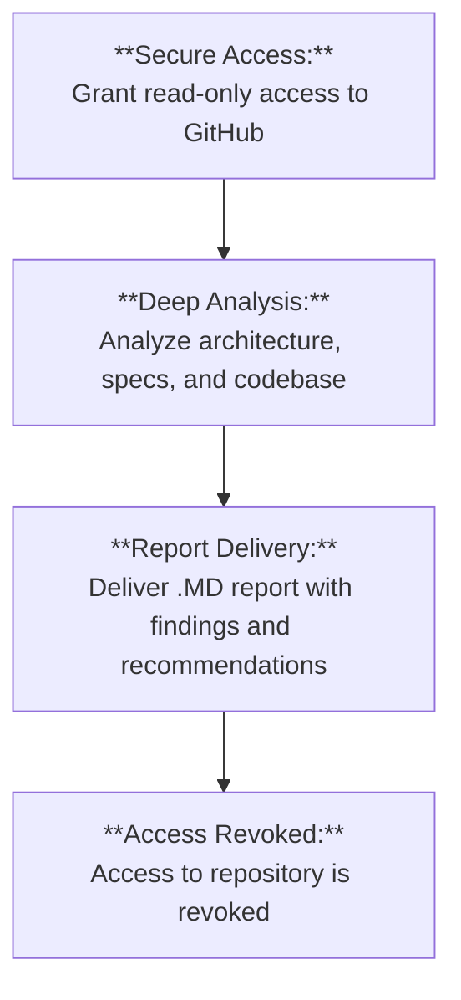

# Protocol Design Analysis

**We analyze your protocol as a whole system — code, economics, and incentives — to surface design-level risks that traditional audits miss.**

### Who it's for

- Teams designing new L1/L2 protocols, AMMs, lending markets, or cross-chain bridges
- Protocols approaching mainnet launch, major upgrade, or governance change
- Engineering and research leaders who want mathematically-grounded confidence, not just bug lists

<a href="/en/contact/#request-analysis" class="button ds-button" style="margin-right: var(--ds-space-3);">Request Analysis</a>
<a href="/en/use-cases/" class="button ds-button ds-button--secondary">View use cases</a>

---

## Outcomes you can expect

- Identify systemic design weaknesses before they become expensive exploits
- Gain a shared, rigorous understanding of how your protocol behaves under edge cases and adversarial strategies
- Make governance and economic design decisions with explicit, documented assumptions

---

## Our analysis process

<ol class="ds-steps">
  <li class="ds-step">
    
1

    

      <h3>Scoping</h3>
      
We align on your goals, critical properties, and constraints. Together we choose the parts of the protocol that matter most.

    

  </li>
  <li class="ds-step">
    
2

    

      <h3>Modeling</h3>
      
We build or refine formal models of the protocol, capturing state transitions, invariants, and economic rules.

    

  </li>
  <li class="ds-step">
    
3

    

      <h3>Exploration</h3>
      
We explore the model using theorem provers, model checking, and game-theoretic reasoning to search for failure modes.

    

  </li>
  <li class="ds-step">
    
4

    

      <h3>Reporting</h3>
      
We deliver a written report with findings, counterexamples where possible, and prioritized recommendations.

    

  </li>
  <li class="ds-step">
    
5

    

      <h3>Follow-up</h3>
      
We walk through the results with your team and answer detailed technical questions.

    

  </li>
</ol>

---

## Typical timelines

Exact timelines depend on protocol complexity and scope. As a guideline:

- **Focused component or mechanism:** ~2–3 weeks
- **Full-protocol design pass** (without implementation verification): ~4–6 weeks
- **Deep formalization of critical components:** typically scheduled as a follow-on engagement

_These are indicative ranges, not guarantees; each engagement is scoped explicitly._

---

## What we need from you

- High-level architecture diagrams and protocol description
- Access to specifications, whitepapers, and relevant research notes
- Read-only access to repositories (if code already exists)
- A point-of-contact on your side (engineering or research) for questions and clarifications

---

## What you receive

- **Written risk report** (Markdown or PDF) with:
  - Clear description of identified risks and why they arise
  - Links to the underlying formal models or reasoning steps where applicable
  - Suggested mitigations and trade-off discussion
- **Optional formal models/specifications** for key components, suitable as a base for further verification
- **A closing call or workshop** to walk through findings with your team

---

## Sample report structure

- Executive summary
- Scope and assumptions
- Protocol overview
- Formal model / specification overview
- Identified risks (by severity, with reasoning)
- Economic and game-theoretic observations
- Recommended changes and next steps

---

## Frequently asked questions

**Q: How is this different from a traditional smart contract audit?**  
A: We focus on design-level properties and incentives rather than only code-level bugs. Our work often precedes or complements a traditional audit.

**Q: Do you need our code to be finished?**  
A: No. We can start from specifications, prototypes, or partial implementations. Earlier is often better.

**Q: Can we reuse the models you build?**  
A: Yes. Wherever possible, we write models and specifications so that your team can extend and reuse them in future work.

---

<section class="ds-cta" style="margin: var(--ds-space-10) 0;">
  <h2 class="ds-cta__title">Ready to scope your analysis?</h2>
  
Share your protocol documentation and we will propose a focused analysis scope.

  

    <a href="/en/contact/#request-analysis" class="button ds-button">Request Analysis</a>
    <a href="/en/papers/" class="button ds-button ds-button--secondary">View example research</a>
  

</section>

>"If you don’t do this design right from the beginning, then every piece of the code you write is a patch. And you start out from day 1 with a mess." – Leslie Lamport

Is your protocol's architecture sound? Are your economic incentives exploitable? 

We go beyond standard audits to analyze the fundamental design of your system,      
 de-risking your project before you write a single line of code.

 Throughout history castles have been built to protect assets, whether financial or people such as the heirs to a kingdom. Castles are only as secure as their design and supporting infrastructure.

Hiroshima castle was actually built before the surrounding city was established. This was an intentional design choice.

For a moment, consider your protocol as a castle.

As protocols 🏯 and their infrastructure 🏙 become more complex in their interactions, so does the complexity of security. 

<!---  --->

| Hiroshima Castle (1644)| Hiroshima Castle (1899) | Hiroshima Castle (2025) |
| :--------------: | :--------------: | :--------------: |
|  |  |  |

## Our Methodology: The 2-Layer Analysis 
###  Layer 1 (The Foundation): Static code and system analysis
* We use static analysis tools acting similarly to compilers-frontend with rich AST-based models (linking resolutions, type inference, etc.)
* Taint and flow analysis (data and control) is usual for Web2 security tools; we bring it to Web3 tools
* We use the Inference mathematical model that we developed ourselves, and we as the Inference formal specification programming language that enables us to reason about the code using theorem provers effectively
* We are Specializing in WASM
* We use AI to solve traditional static analysis complex problems, such as matching original high-level code with byte code, complex graph analysis, filter false-positives.

### Layer 2 (The Insight): Strategic Design Analysis   (Architectural, Economic & Game-Theoretic Diagnosis)
* Our team has an academic background. Expertise in game theory, formal logic, algorithms, and programming languages
* We consider protocols as
    - A structure with many participants acting within the realm of the protocol
    - As a unit that acts as a participant in the global Web3 landscape
* We provide a strategic-level analysis that identifies
    - How well a protocol is designed technically (using results from the Layer 1)
    - How well a protocol is designed mathematically
    - What can happen if protocol participants act in a certain manner, or what if 3rd parties act against or for the protocol

By applying our insights you can ensure your protocol is ready to be visited by people around the world, just like a beautiful castle. 
Secure but welcoming.

## Ready to Fortify Your Protocol?

Take the first step towards building a secure protocol. Contact us to start your Protocol Analysis and gain true confidence in your system's foundation.

[Contact us Directly](mailto:info@inferara.com)
---

## Are Hidden Flaws Putting Your Protocol at Risk?

Catastrophic exploits often stem not from simple coding errors, but from deep, systemic vulnerabilities in a protocol's design. These design level flaws in economic models, governance structures, or cross-chain interactions are invisible to traditional audits.

## Our Solution: Personalized Protocol Analysis

We move beyond code level bug hunting to provide a holistic analysis of your protocol's conceptual and architectural soundness. Our methodology is built on three pillars to ensure fundamental resilience.

* **Formal Methods:** We use rigorous mathematical techniques to model protocol behavior and prove critical properties, providing mathematical guarantees of system correctness before implementation.

* **Precise Tooling:** We apply specialized in house tools paired with custom AI observations to perform a thorough investigation. 

* **Game Theory:** We analyze economic incentives and adversarial strategies to identify and mitigate potential exploits or undesirable outcomes, securing your protocol's economic layer.

## A Clear Path to Confidence

Our process is transparent, collaborative, and designed for clarity.

1.  **Secure Access:** You grant us temporary, read-only access to your GitHub repository. Your intellectual property remains secure and confidential at all times.

2.  **Deep Analysis:** Our team analyzes your architecture, specifications, and codebase using our advanced tooling and core principles from formal methods and game theory.

3.  **Report Delivery:** We deliver a comprehensive .MD report detailing our findings, risk assessments, and actionable recommendations for design improvements.

4.  **Access Revoked:** Upon project completion, our access to your repository is immediately and permanently revoked, ensuring your code remains untampered.

## The Financial Impact of Design Flaws

The cost of a hidden design flaw can be catastrophic. Our analysis is an investment in preventing huge losses and preserving your protocol's future.

## Our Expert Team

Our deep expertise is what truly differentiates Inferara. We bring together academic researchers and practical Web3 experience to provide unparalleled protocol analysis. The team with such people working together for years is a rare find in the Web3 space.

One of our key team members exemplifies this commitment to excellence and foundational understanding:

* **PhD in Influence of Additional Information Asymmetry on the Solutions of Non-Antagonistic Games**. This specialized research directly informs our game-theoretic analysis of protocol incentives and adversarial behaviors.

* **MS in Algorithmic Languages**. This background provides a profound understanding of the precise definition and analysis of complex computational processes, crucial for formal specification and verification.

* **MS in Computer Science and mathematical modelling**. This equips us with the skills to rigorously model and analyze protocol behavior, ensuring that our findings are grounded in solid theoretical foundations.

* **Published Researcher** with works featured on [Mathnet](https://www.mathnet.ru/php/person.phtml?option_lang=eng&personid=147678), demonstrating peer-reviewed academic rigor and thought leadership in relevant mathematical and logical domains.

* **Active Contributor to Web3 Foundational Research** on [GitHub](https://github.com/Inferara), bridging academic theory with practical, open-source development in critical areas like new programming language specifications (`inference-language-spec`), WebAssembly tooling (`inf-wasm-tools`), and formal specifications for blockchain components (`merkle-tree-wasm-spec`).

This unique combination of a strong theoretical foundation in formal methods and game theory, coupled with hands-on contributions to cutting edge Web3 infrastructure, ensures that our analysis is not only academically sound but also directly relevant to real-world protocol challenges and emergent vulnerabilities.

## [Start Your Analysis](mailto:info@inferara.com)
