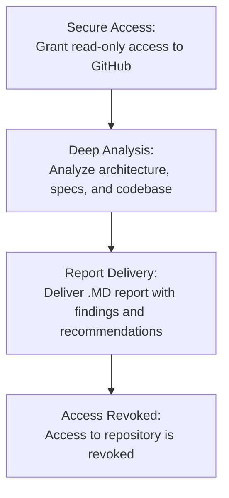

## Go beyond bug finding. We analyze your project's core Design.

We provide a strategic, unbiased analysis of your protocol's foundational architecture, uncovering flawed economic incentives and game theoretic weaknesses that that conventional methods cannot find.

## Pricing Tiers

Choose the analysis that fits your protocol's current stage. All tiers are part of our Limited Time Beta Program.

| Service Tier      | Price       | Key Features                                                                                                                                                                                                                                                             | Turnaround Time (after approve)   |
| :---------------- | :---------- | :----------------------------------------------------------------------------------------------------------------------------------------------------------------------------------------------------------------------------------------------------------------------- | :----------------- |
| **Quick Scan** | $1,000      | - Automated tooling run - Automatically generated report - Brief expert review                                                                                                                                                                                   | 1 business day     |
| **Standard Report** | $5,000      | - Automated tooling run - Personalized expert review - Comprehensive analysis report                                                                                                                                   | 3 business days    |
| **Deep Analysis** | Contact Us  | - All Standard features, **plus**: - Dedicated team with professional mathematicians - Formal modeling & verification - Strategic advisory -Direct communication & iterations                                                                                       | Custom timeline    |
---
Payment accepted through standard methods.

Since we develop Web3 space, payments in crypto are welcome.

## Ready to Fortify Your Protocol?

Take the first step towards building a secure protocol. Contact us to start your Protocol Analysis and gain true confidence in your system's foundation.

------->[Email Us](mailto:info@inferara.com)
---

## Are Hidden Flaws Putting Your Protocol at Risk?

Catastrophic exploits often stem not from simple coding errors, but from deep, systemic vulnerabilities in a protocol's design. These design level flaws in economic models, governance structures, or cross-chain interactions are invisible to traditional audits.

Just take a look of the most recent exploits within just the first part of 2025
### Recent Protocol Exploit Examples:

* **The $11M Cork Protocol Hack:** On the 28th of May 2025 
a critical lesson in Uniswap v4 hook security was learned. A subtle flaw in a callback mechanism, not a simple bug, led to a complete drain of funds. This highlights the dangers of complex interactions between protocol components.
    [Learn More →](https://dedaub.com/blog/the-11m-cork-protocol-hack-a-critical-lesson-in-uniswap-v4-hook-security/)

* **The $22.3M Cetus Hack:** On May 22, 2025 a shared library bug triggered a massive exploit, demonstrating how dependencies can introduce unforeseen attack vectors. True resilience requires analyzing the entire system, not just your direct codebase.
    [Learn More →](https://www.merklescience.com/blog/hack-track-how-a-shared-library-bug-triggered-the-223m-cetus-hack)

* **The Alex Protocol Exploit:** On June 6 of 2025 this incident exposed vulnerabilities in how protocols manage permissions and private keys, proving that technical security and operational security are deeply intertwined in the design phase.
    [Learn More →](https://www.onesafe.io/blog/alex-protocol-exploit-lessons-in-defi-security)

## Our Solution: Personalized Protocol Analysis

We move beyond code level bug hunting to provide a holistic analysis of your protocol's conceptual and architectural soundness. Our methodology is built on three pillars to ensure fundamental resilience.

* **Formal Methods:** We use rigorous mathematical techniques to model protocol behavior and prove critical properties, providing mathematical guarantees of system correctness before implementation.

* **Precise Tooling:** We apply specialized in house tools paired with custom AI observations to perform a thorough investigation. 

* **Game Theory:** We analyze economic incentives and adversarial strategies to identify and mitigate potential exploits or undesirable outcomes, securing your protocol's economic layer.

## A Clear Path to Confidence

Our process is transparent, collaborative, and designed for clarity.

1.  **Secure Access:** You grant us temporary, read-only access to your GitHub repository. Your intellectual property remains secure and confidential at all times.

2.  **Deep Analysis:** Our team analyzes your architecture, specifications, and codebase using our advanced tooling and core principles from formal methods and game theory.

3.  **Report Delivery:** We deliver a comprehensive .MD report detailing our findings, risk assessments, and actionable recommendations for design improvements.

4.  **Access Revoked:** Upon project completion, our access to your repository is immediately and permanently revoked, ensuring your code remains untampered.

## The Financial Impact of Design Flaws

The cost of a hidden design flaw can be catastrophic. Our analysis is an investment in preventing huge losses and preserving your protocol's future.

## Our Expert Team

Our deep expertise is what truly differentiates Inferara. We bring together academic researchers and practical Web3 experience to provide unparalleled protocol analysis. The team with such people working together for years is a rare find in the Web3 space.

One of our key team members exemplifies this commitment to excellence and foundational understanding:

* **PhD in Influence of Additional Information Asymmetry on the Solutions of Non-Antagonistic Games**. This specialized research directly informs our game-theoretic analysis of protocol incentives and adversarial behaviors.

* **MS in Algorithmic Languages**. This background provides a profound understanding of the precise definition and analysis of complex computational processes, crucial for formal specification and verification.

* **MS in Computer Science and mathematical modelling**. This equips us with the skills to rigorously model and analyze protocol behavior, ensuring that our findings are grounded in solid theoretical foundations.

* **Published Researcher** with works featured on [Mathnet](https://www.mathnet.ru/php/person.phtml?option_lang=eng&personid=147678), demonstrating peer-reviewed academic rigor and thought leadership in relevant mathematical and logical domains.

* **Active Contributor to Web3 Foundational Research** on [GitHub](https://github.com/Inferara), bridging academic theory with practical, open-source development in critical areas like new programming language specifications (`inference-language-spec`), WebAssembly tooling (`inf-wasm-tools`), and formal specifications for blockchain components (`merkle-tree-wasm-spec`).

This unique combination of a strong theoretical foundation in formal methods and game theory, coupled with hands-on contributions to cutting edge Web3 infrastructure, ensures that our analysis is not only academically sound but also directly relevant to real-world protocol challenges and emergent vulnerabilities.

## [Start Your Analysis](mailto:info@inferara.com)
