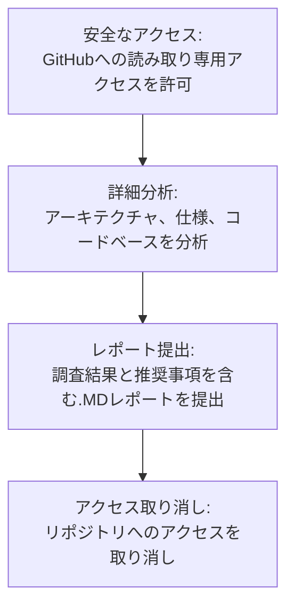

# プロトコル設計分析サービス

**コード・経済設計・インセンティブを含めた「プロトコル全体」を対象に、従来の監査では見えにくい設計レベルのリスクを特定します。**

### 対象となる方

- 新規L1/L2プロトコル、AMM、レンディング市場、クロスチェーンブリッジを設計中のチーム
- メインネットローンチ、大規模アップグレード、ガバナンス変更を予定しているプロトコル
- 単なるバグリストではなく、数学的に裏付けられた確信を求めるエンジニアリング・研究リーダー

<a href="/jp/contact/#request-analysis" class="button ds-button" style="margin-right: var(--ds-space-3);">分析を依頼する</a>
<a href="/jp/use-cases/" class="button ds-button ds-button--secondary">ユースケースを見る</a>

---

## 期待できる成果

- 高額なエクスプロイトにつながりうる設計上の弱点を、ローンチ前に特定
- エッジケースや敵対的な振る舞いに対して、プロトコルがどう振る舞うかをチーム全体で共有
- ガバナンスや経済設計の意思決定を、明示的な仮定に基づいて行えるようにします

---

## 分析プロセス

<ol class="ds-steps">
  <li class="ds-step">
    
1

    

      <h3>スコープ設定</h3>
      
目標、重要な性質、制約を調整します。プロトコルの最も重要な部分を一緒に選びます。

    

  </li>
  <li class="ds-step">
    
2

    

      <h3>モデル化</h3>
      
状態遷移、不変条件、経済ルールをキャプチャした、プロトコルの形式モデルを構築または改良します。

    

  </li>
  <li class="ds-step">
    
3

    

      <h3>探索</h3>
      
定理証明器、モデルチェック、ゲーム理論的推論を使用してモデルを探索し、障害モードを検索します。

    

  </li>
  <li class="ds-step">
    
4

    

      <h3>報告</h3>
      
発見事項、可能な場合は反例、優先順位付けされた推奨事項を含む書面報告書を提出します。

    

  </li>
  <li class="ds-step">
    
5

    

      <h3>フォローアップ</h3>
      
貴チームと結果を確認し、詳細な技術的質問にお答えします。

    

  </li>
</ol>

---

## 標準的なタイムライン

正確なタイムラインは、プロトコルの複雑さと範囲によって異なります。目安として：

- **特定のコンポーネントまたはメカニズム：** 約2〜3週間
- **完全なプロトコル設計パス**（実装検証なし）：約4〜6週間
- **重要コンポーネントの深い形式化：** 通常、フォローアップ契約としてスケジュール

_これらは目安であり、保証ではありません。各契約は明示的にスコープされます。_

---

## 必要な情報

- プロトコルの概要資料・アーキテクチャ図
- 仕様書・ホワイトペーパー・研究ノート等
- （存在する場合）コードリポジトリへの読み取り専用アクセス
- 質問や説明のための担当者（エンジニアリングまたは研究）

---

## 提供物

- **リスクレポート**（MarkdownまたはPDF）：
  - 特定されたリスクの明確な説明とその理由
  - 該当する場合、基礎となる形式モデルまたは推論ステップへのリンク
  - 推奨される緩和策とトレードオフの議論
- **主要コンポーネントの形式モデル/仕様**（オプション）、さらなる検証の基礎として使用可能
- **結果を確認するためのクロージングコールまたはワークショップ**

---

## サンプルレポート構成

- エグゼクティブサマリー
- スコープと仮定
- プロトコル概要
- 形式モデル/仕様概要
- 特定されたリスク（重大度別、理由付き）
- 経済的およびゲーム理論的観察
- 推奨される変更と次のステップ

---

## よくある質問

**Q: 従来のスマートコントラクト監査とどう違いますか？**  
A: コードレベルのバグだけでなく、設計レベルの特性とインセンティブに焦点を当てます。私たちの仕事は、従来の監査に先立つか、補完することがよくあります。

**Q: コードが完成している必要がありますか？**  
A: いいえ。仕様、プロトタイプ、または部分的な実装から始めることができます。早い方が良いことが多いです。

**Q: 構築したモデルを再利用できますか？**  
A: はい。可能な限り、貴チームが将来の作業で拡張および再利用できるようにモデルと仕様を作成します。

---

<section class="ds-cta" style="margin: var(--ds-space-10) 0;">
  <h2 class="ds-cta__title">分析のスコープを設定しませんか？</h2>
  
プロトコル資料を共有いただければ、スコープを絞った分析プランをご提案します。

  

    <a href="/jp/contact/#request-analysis" class="button ds-button">分析を依頼する</a>
    <a href="/jp/papers/" class="button ds-button ds-button--secondary">研究例を見る</a>
  

</section>

## プロトコルを強化する準備はできましたか？

安全なプロトコルを構築するための第一歩を踏み出しましょう。プロトコル分析を開始し、システム基盤に真の自信を得るために、お問い合わせください。

------>[メールでお問い合わせ](mailto:info@inferara.com)
---

## 隠れた欠陥がプロトコルを危険に晒していませんか？

壊滅的なエクスプロイトは、単純なコーディングエラーからではなく、プロトコルの設計における深く体系的な脆弱性から生じることがよくあります。経済モデル、ガバナンス構造、またはクロスチェーン相互作用におけるこれらの設計レベルの欠陥は、従来の監査では見えません。

2025年の前半だけでも、ごく最近のエクスプロイト例をご覧ください。

### 最近のプロトコルエクスプロイト例：

  * **1,100万ドルのCork Protocolハック:** 2025年5月28日、Uniswap v4フックのセキュリティに関する重要な教訓が学ばれました。単純なバグではなく、コールバックメカニズムの微妙な欠陥が資金の完全な流出につながりました。これは、プロトコルコンポーネント間の複雑な相互作用の危険性を浮き彫りにしています。
    [詳細はこちら →](https://dedaub.com/blog/the-11m-cork-protocol-hack-a-critical-lesson-in-uniswap-v4-hook-security/)

  * **2,230万ドルのCetusハック:** 2025年5月22日、共有ライブラリのバグが大規模なエクスプロイトを引き起こし、依存関係が予期せぬ攻撃ベクトルをどのように導入するかを示しました。真のレジリエンスには、直接のコードベースだけでなく、システム全体を分析することが必要です。
    [詳細はこちら →](https://www.merklescience.com/blog/hack-track-how-a-shared-library-bug-triggered-the-223m-cetus-hack)

  * **Alex Protocolエクスプロイト:** 2025年6月6日、この事件はプロトコルが権限と秘密鍵をどのように管理するかの脆弱性を露呈し、技術的セキュリティと運用セキュリティが設計段階で深く絡み合っていることを証明しました。
    [詳細はこちら →](https://www.onesafe.io/blog/alex-protocol-exploit-lessons-in-defi-security)

## 私たちのソリューション：パーソナライズされたプロトコル分析

私たちはコードレベルのバグハンティングを超え、プロトコルの概念的およびアーキテクチャ的な健全性を包括的に分析します。当社の方法論は、根本的な回復力を確保するための3つの柱に基づいています。

  * **形式手法:** 厳密な数学的手法を用いてプロトコル動作をモデル化し、重要な特性を証明することで、実装前にシステムの正確性を数学的に保証します。

  * **精密なツール:** 自社開発の特殊なツールとカスタムAI観察を組み合わせ、徹底的な調査を実施します。

  * **ゲーム理論:** 経済的インセンティブと敵対的戦略を分析し、潜在的なエクスプロイトや望ましくない結果を特定して軽減し、プロトコルの経済レイヤーを保護します。

## 自信への明確な道筋

当社のプロセスは透明性があり、協調的で、明確さを重視して設計されています。

1.  **安全なアクセス:** お客様は、お客様のGitHubリポジトリへの一時的な読み取り専用アクセスを当社に付与します。お客様の知的財産は常に安全かつ機密に保たれます。

2.  **詳細分析:** 当社のチームは、高度なツールと形式手法およびゲーム理論のコア原則を使用して、お客様のアーキテクチャ、仕様、およびコードベースを分析します。

3.  **レポート提出:** 調査結果、リスク評価、および設計改善のための実用的な推奨事項を詳述した包括的な.MDレポートを提出します。

4.  **アクセス取り消し:** プロジェクト完了後、お客様のリポジトリへの当社のアクセスは直ちに永久に解除され、お客様のコードが改ざんされないことを保証します。

## 設計上の欠陥がもたらす経済的影響

隠れた設計上の欠陥のコストは壊滅的です。当社の分析は、莫大な損失を防ぎ、プロトコルの将来を保護するための投資です。

## 私たちの専門家チーム

当社の深い専門知識こそがInferaraを真に差別化するものです。学術研究者と実用的なWeb3の経験を結集し、比類のないプロトコル分析を提供します。このような人材が長年にわたって協力しているチームは、Web3業界では珍しい存在です。

当社の主要なチームメンバーの1人は、卓越性と基礎的理解へのこのコミットメントを体現しています。

  * **非敵対的ゲームの解における追加情報の非対称性の影響に関する博士号**。この専門的な研究は、プロトコルのインセンティブと敵対的行動に関する当社のゲーム理論分析に直接影響を与えます。

  * **アルゴリズム言語の修士号**。この背景は、複雑な計算プロセスの正確な定義と分析に対する深い理解を提供し、形式的な仕様と検証に不可欠です。

  * **コンピューターサイエンスと数理モデリングの修士号**。これにより、プロトコル動作を厳密にモデル化および分析するスキルが身につき、当社の調査結果が確固たる理論的基盤に基づいていることを保証します。

  * [Mathnet](https://www.mathnet.ru/php/person.phtml?option_lang=eng&personid=147678)で作品を発表している**出版研究者**であり、関連する数学的および論理的領域におけるピアレビューされた学術的厳密性とソートリーダーシップを示しています。

  * [GitHub](https://github.com/Inferara)で**Web3基礎研究に積極的に貢献**しており、新しいプログラミング言語仕様（`inference-language-spec`）、WebAssemblyツール（`inf-wasm-tools`）、ブロックチェーンコンポーネントの形式仕様（`merkle-tree-wasm-spec`）などの重要な分野で、学術理論と実践的なオープンソース開発を橋渡ししています。

形式手法とゲーム理論における強力な理論的基盤と、最先端のWeb3インフラへの実践的な貢献というこのユニークな組み合わせにより、当社の分析は学術的に健全であるだけでなく、実際のプロトコルの課題や新たな脆弱性に直接関連していることが保証されます。

## [分析を開始する](mailto:info@inferara.com)
